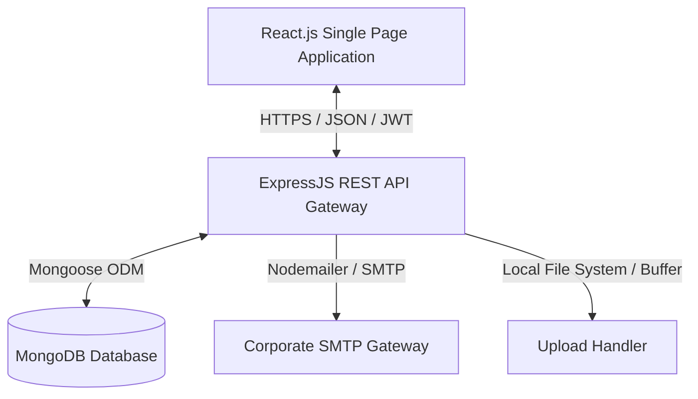

# Technical Reference & Architecture Manual

This manual contains the core system architecture, database design, API routing definitions, deployment parameters, and security policies for the Ticketing System.

---

## 1. Project Overview & Architecture

The Ticketing System is a multi-tenant support portal designed to link client users with technical and functional consultants. The system features dynamic rule-based ticket pre-assignment, work hour tracking, email notification copying, and client performance reporting.

### System Architecture Flow


### Routing Match Evaluation Workflow
When a Client User raises a ticket:
1. The backend loads active pre-assignment rules sorted by `evaluationOrder` (ascending).
2. It sequential-checks the rules:
   * **raiser match**: Does `rule.clientUser` equal the raiser ID?
   * **client match**: Does `rule.client` equal the raiser's client company?
   * **department match**: Does `rule.department` equal the ticket department? If yes, and `rule.categories` has values: does `ticket.category` exist in `rule.categories`?
   * **ERP Incident Type match**: Is the ticket's `erpIncidentType` included in `rule.erpIncidentType` array?
3. The first matched rule assigns the ticket to its `assignedTo` consultant. If no rules match, the ticket is assigned to the Super Admin.

---

## 2. Technology Stack

* **Frontend Engine**: React 18, Vite 8, Zustand (State Store), TailwindCSS & Vanilla CSS Engine (Dynamic Variables).
* **Backend Runtime**: Node.js 20+, Express 4.
* **Database / ODM**: MongoDB 6+ / Mongoose 8.
* **Authentication**: JWT (JSON Web Tokens) with HttpOnly Cookies / Bearer Header tokens.
* **File Processing**: Multer middleware processing file buffers directly to database binary schemas.
* **Mail Delivery**: Nodemailer SMTP Client with asynchronous CC distribution logic.

---

## 3. Folder Structure

```
├── client/                      # React Frontend Source Code
│   ├── src/
│   │   ├── assets/              # Icons, Logos, Static Assets
│   │   ├── components/          # Reusable UI Blocks (modals, inputs, buttons)
│   │   ├── features/            # Feature Panels (user, consultant, superadmin)
│   │   ├── store/               # Zustand Global State Containers
│   │   ├── App.jsx              # Main React Bootstrap & Theme Provider
│   │   ├── index.css            # Global Styling System & Custom Variable Overrides
│   │   └── main.jsx             # React DOM Mounting Script
│   ├── vite.config.js           # Vite Compilation Options
│   └── package.json             # Frontend Dependencies
├── server/                      # NodeJS Express Backend Code
│   ├── src/
│   │   ├── config/              # Database & Mail Server Configurations
│   │   ├── controllers/         # Express Route Handlers (logic wrappers)
│   │   ├── middleware/          # JWT Guards, Upload Parsers, Role Checkers
│   │   ├── models/              # Mongoose DB Schema Mappings
│   │   ├── routes/              # Express Endpoints Definition
│   │   ├── services/            # Transaction Logic Services (e.g. ticket.service.js)
│   │   └── app.js               # Node Application Setup
│   ├── .env.example             # Template Environment Variables
│   └── package.json             # Backend Node Dependencies
└── docs/                        # Project System Documentation
```

---

## 4. Database Schema Definitions

The database uses MongoDB. Below are the key Mongoose schemas:

### `ClientUser` Schema (Collection: `clientusers`)
Represents users, including Client Users, Consultants, Admins, and Super Admins.
```javascript
const clientUserSchema = new Schema({
  name: { type: String, required: true },
  email: { type: String, required: true, unique: true, lowercase: true },
  password: { type: String, required: true },
  role: { type: String, enum: ['clientuser', 'consultant', 'admin', 'superadmin'], required: true },
  status: { type: String, enum: ['active', 'inactive'], default: 'active' },
  client: { type: Schema.Types.ObjectId, ref: 'Client', default: null },
  department: { type: Schema.Types.ObjectId, ref: 'Department', default: null },
  preferences: {
    theme: { type: String, enum: ['light', 'dark', 'system'], default: 'dark' },
    primaryColor: { type: String, default: null },
    accentColor: { type: String, default: null },
    emailNotifications: { type: Boolean, default: true },
    autoRefreshInterval: { type: Number, default: 30 },
    soundEnabled: { type: Boolean, default: true }
  },
  lastLogin: { type: Date }
}, { timestamps: true });
```

### `Client` Schema (Collection: `clients`)
Stores client company parameters and ERP settings.
```javascript
const clientSchema = new Schema({
  name: { type: String, required: true },
  domain: { type: String, required: true },
  contactPerson: { type: String },
  contactEmail: { type: String },
  contactPhone: { type: String },
  status: { type: String, enum: ['active', 'inactive'], default: 'active' },
  erpDetails: {
    erpName: { type: String, default: 'SAP Business One' },
    sapB1VersionType: { type: String, enum: ['SQL', 'HANA', 'N/A'], default: 'HANA' },
    sapB1VersionAndFP: { type: String, default: '' },
    sapLicenseAMC: { type: Boolean, default: false },
    sapSupportAMC: { type: Boolean, default: false },
    sapSupportAMCType: { type: String, enum: ['AMC Fixed', 'Hourly Rate', 'N/A'], default: 'N/A' },
    sapSupportHourlyCap: { type: Number, default: 0 },
    erpIncidentTypes: [{ type: String }],
    hoursUsed: { type: Number, default: 0 }
  }
}, { timestamps: true });
```

### `PreAssignmentRule` Schema (Collection: `preassignmentrules`)
Stores pre-assignment criteria.
```javascript
const preAssignmentRuleSchema = new Schema({
  name: { type: String, required: true },
  conditionType: { type: String, enum: ['clientUser', 'client', 'department', 'erpIncidentType'], required: true },
  clientUser: { type: Schema.Types.ObjectId, ref: 'ClientUser', default: null },
  client: { type: Schema.Types.ObjectId, ref: 'Client', default: null },
  department: { type: Schema.Types.ObjectId, ref: 'Department', default: null },
  categories: [{ type: String, trim: true }],
  erpIncidentType: [{ type: String, trim: true }],
  assignedTo: { type: Schema.Types.ObjectId, ref: 'ClientUser', required: true },
  ccConsultants: [{ type: Schema.Types.ObjectId, ref: 'ClientUser' }],
  evaluationOrder: { type: Number, default: 0 },
  isActive: { type: Boolean, default: true }
}, { timestamps: true });
```

### `Ticket` Schema (Collection: `tickets`)
Tracks support tickets.
```javascript
const fileSubSchema = {
  filename: String,
  originalName: String,
  mimeType: String,
  size: Number,
  data: Buffer,
  uploadedAt: { type: Date, default: Date.now }
};

const ticketSchema = new Schema({
  ticketNumber: { type: String, required: true, unique: true },
  title: { type: String, required: true },
  description: { type: String, required: true },
  category: { type: String, default: null },
  reason: { type: String, default: null },
  attachments: [fileSubSchema],
  supportingDocuments: [fileSubSchema],
  adminAttachments: [fileSubSchema],
  priority: { type: String, enum: ['low', 'medium', 'high', 'critical'], default: 'medium' },
  department: { type: Schema.Types.ObjectId, ref: 'Department', required: true },
  createdBy: { type: Schema.Types.ObjectId, ref: 'ClientUser', required: true },
  status: { type: String, enum: ['pending', 'assigned', 'hold', 'resolved', 'closed', 'cancelled'], default: 'pending' },
  assignedTo: { type: Schema.Types.ObjectId, ref: 'ClientUser', default: null },
  ccEmails: [{ type: String }],
  erpIncidentType: { type: String, default: null },
  assignmentHistory: [{
    action: String,
    assignedTo: { type: Schema.Types.ObjectId, ref: 'ClientUser' },
    remarks: String,
    actionDate: { type: Date, default: Date.now }
  }],
  workLogs: [{
    consultant: { type: Schema.Types.ObjectId, ref: 'ClientUser' },
    hours: Number,
    date: Date,
    description: String
  }],
  feedback: {
    rating: { type: Number, min: 1, max: 5 },
    comment: String,
    submittedAt: Date
  }
}, { timestamps: true });
```

---

## 5. API Documentation

All routes are prefixed by `/api`.

### Authentication Routes
* `POST /auth/login`: Authenticates user, sets session, and returns JWT.
* `POST /auth/change-password`: Force reset password (temporary credential verification).
* `GET /auth/me`: Verifies active session token.
* `POST /auth/logout`: Invalidates session.

### Ticket Routes
* `GET /tickets`: Retrieves filtered list of tickets based on user role.
* `POST /tickets`: Creates a new ticket. Accept multipart form-data.
* `GET /tickets/:id`: Retrieves ticket details.
* `POST /tickets/:id/remarks`: Posts comment or logs request parameters.
* `POST /tickets/:id/resolve`: Submits solution. (Consultant Role).
* `POST /tickets/:id/feedback`: Submits rating and closes ticket. (Client Role).
* `POST /tickets/:id/work-logs`: Logs consultant hours.

### Admin Settings Routes
* `GET /pre-assignment-rules`: Lists all pre-assignment rules.
* `POST /pre-assignment-rules`: Creates a routing rule.
* `PUT /pre-assignment-rules/:id`: Updates routing parameters.
* `DELETE /pre-assignment-rules/:id`: Deletes a routing rule.
* `GET /cc-emails`: Retrieves all CC email settings.
* `POST /cc-emails`: Creates/saves CC email address rules.
* `DELETE /cc-emails/:id`: Deletes CC recipient profiles.

---

## 6. Authentication & Authorization

### Session Handlers
Users are validated using **JSON Web Tokens (JWT)**.
* Upon login, a token is signed with a payload containing `{ id, role, clientCompanyId }`.
* The token is returned in response headers or verified cookies.

### Middleware Guards
* `protect`: Verifies JWT validity. Attaches `req.user` context.
* `restrictTo(...roles)`: Verifies role membership. Throws `403 Forbidden` if unauthorized.
  * *Example*: Pre-assignment routing and CC email management endpoints require `restrictTo('superadmin')`.

---

## 7. Configuration & Environment Variables

Create a `.env` configuration file in the `server` root directory:

```env
PORT=5000
NODE_ENV=production
MONGO_URI=mongodb://localhost:27017/ticket_system
JWT_SECRET=your_long_secure_jwt_secret_phrase

# Mail Transporter Configurations
SMTP_HOST=smtp.yourcorporate.com
SMTP_PORT=587
SMTP_USER=no-reply@yourcorporate.com
SMTP_PASS=securepassword
SMTP_FROM=no-reply@yourcorporate.com
```

---

## 8. Installation & Production Deployment

### Prerequisites
* Node.js v20.x or higher
* MongoDB Server v6.0 or higher

### Installation Steps

1. **Clone the project repository**:
   ```bash
   git clone https://github.com/your-repo/ticketing-system.git
   cd ticketing-system
   ```

2. **Install dependencies**:
   ```bash
   # Install Server dependencies
   cd server
   npm install
   
   # Install Client dependencies
   cd ../client
   npm install
   ```

3. **Build the Frontend Client**:
   ```bash
   cd client
   npm run build
   ```
   This generates a `dist/` production folder containing optimized HTML, CSS, and JS chunks.

4. **Production Server Startup**:
   Configure the environment variables in `server/.env` and start the server using a process manager:
   ```bash
   cd ../server
   npm install -g pm2
   pm2 start src/app.js --name "ticketing-backend"
   ```

5. **Nginx Reverse Proxy Configuration (Recommended)**:
   Serve client assets directly and proxy `/api` routes to Node.js backend:
   ```nginx
   server {
       listen 80;
       server_name support.yourcompany.com;

       location / {
           root /path/to/ticketing-system/client/dist;
           try_files $uri $uri/ /index.html;
       }

       location /api/ {
           proxy_pass http://localhost:5000/api/;
           proxy_http_version 1.1;
           proxy_set_header Upgrade $http_upgrade;
           proxy_set_header Connection 'upgrade';
           proxy_set_header Host $host;
           proxy_cache_bypass $http_upgrade;
       }
   }
   ```

---

## 9. Backup & Recovery Plan

### Database Backup
Use `mongodump` to generate database backups. Configure a daily cron job:
```bash
#!/bin/bash
BACKUP_DIR="/var/backups/mongodb"
DATE=$(date +%F)
mongodump --uri="mongodb://localhost:27017/ticket_system" --out="$BACKUP_DIR/$DATE"
tar -czf "$BACKUP_DIR/backup-$DATE.tar.gz" "$BACKUP_DIR/$DATE"
rm -rf "$BACKUP_DIR/$DATE"
```

### Recovery Steps
To restore database states:
```bash
tar -xzf backup-yyyy-mm-dd.tar.gz
mongorestore --uri="mongodb://localhost:27017/ticket_system" yyyy-mm-dd/ticket_system
```

---

## 10. Security Best Practices

1. **Passwords**: Uses `bcryptjs` with a work factor of 10 for password hashing.
2. **Sanitization**: Database parameters are parsed using Mongoose object IDs to prevent NoSQL injections.
3. **Payload Limitations**: Maximum request sizes are limited to 20MB to prevent Denial of Service (DoS) attacks on file uploads.
4. **CORS Configuration**: Restrict incoming origins to trusted domains.
5. **Secure Headers**: Implement `helmet` on the backend to enforce standard browser security headers.

---

## 11. Maintenance & Troubleshooting

* **Vite build size warnings**: Rolldown builds may highlight chunk warnings. These are standard for packages importing large icons (like `lucide-react`). Code-splitting is configured dynamically.
* **Server Logs**: Server error console captures mongoose execution warnings. Check PM2 logs using:
  ```bash
  pm2 logs ticketing-backend
  ```
* **MongoDB Lookup Aggregation Warning**: If charts on the Consultant dashboard fail to load, verify that the lookup target collection matches `'clientusers'` rather than the legacy collection `'users'`.
